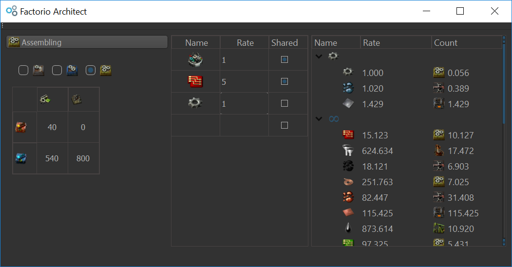

# FactorioArchitect
Finds perfect ratios to produce a given number of items.

## Features
- Considers productivity/speed bonuses from beacons and modules.
- Allows you to set different bonuses depending on if it's an intermediate product or not.
- Computes optimal ratios for all three refining options.
- Pretty UI!

  

## Todo List
- Have the option of different rates (per second, per minute, etc.)
- Consider energy as an ingredient for steam
- Marathon mode recipes
- Option to set and add recipes for individual items
- Option to set bonuses for individual items
- Recipes for different versions
- Possibly make inventory exactly like in-game
- Port to Linux/Mac

You can download the executable [here](https://github.com/glynkwei/FactorioArchitect/releases/latest).

